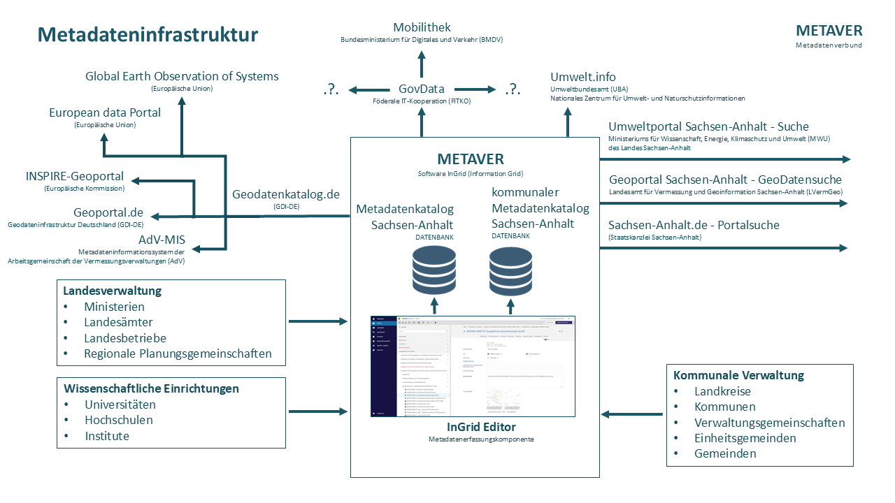
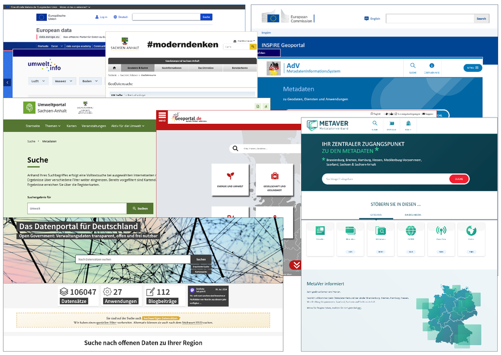

Metadateninfrastruktur
======================

Eine Metadateninfrastruktur ist ein System zur Verwaltung, Organisation und übergreifenden Nutzung von Metadaten:
Sie ermöglicht die effiziente Erfassung, Speicherung und Verarbeitung von Metadaten, um Daten besser auffindbar, verwaltbar und nutzbar zu machen.
Bestandteile einer Metadateninfrastruktur
Eine typische Metadateninfrastruktur besteht aus den folgenden Elementen:

| **Katalogschnittstellen:** Diese ermöglichen den automatisierten Austausch von Metadaten zwischen verschiedenen Systemen, z.B. Catalog Service Web (CSW).

| **Harvesting-Prozesse:** Automatisierte Prozesse zum Sammeln und Aktualisieren von Metadaten aus verschiedenen Quellen.

| **Zentrale Metadatenkataloge:** Diese bündeln Metadaten aus verschiedenen Quellen zu einem zentralen Einstiegspunkt für die Recherche.

| **Standardisierte Formate:** Verwendung von maschinenlesbaren, standardisierten Formaten wie XML zur Beschreibung von Metadaten.

| **Suchfunktionen:** Ermöglichen das gezielte Suchen und Filtern von Daten anhand ihrer Metadaten.
 

   Abb.: Metadatenifrastruktur ausgehend vom Portal METAVER

Abb.: Metadatenifrastruktur ausgehend vom Portal METAVER
Durch die systematische Verwaltung von Metadaten können Organisationen ihre Datenbestände effizienter nutzen und den Wert ihrer Informationsressourcen steigern.

**Warum gibt es innerhalb der Metadateninfrastruktur in Deutschland und der EU so viele Systeme/Portale, die Metadaten harvesten und für die Suche bereitstellen?**

   Abb.: Screenshots Metadatenkataloge und Metadatenportale innerhalb der Metadateninfrastruktur

Es gibt mehrere Gründe für die Vielzahl von Metadaten-Harvesting-Systemen und -Portalen in Deutschland und der EU:

| **Föderale Struktur:** In Deutschland führt die föderale Struktur dazu, dass verschiedene Behörden auf Bundes-, Landes- und kommunaler Ebene eigene Metadatensysteme betreiben.

| **Fachspezifische Anforderungen:** Unterschiedliche Fachbereiche haben spezifische Anforderungen an Metadaten, was zu spezialisierten Portalen führt.

| **Europäische Integration:** Die INSPIRE-Richtlinie zielt auf den Aufbau einer europaweiten Geodateninfrastruktur ab, was zusätzliche übergeordnete Systeme erfordert.

| **Verbesserung der Auffindbarkeit:** Durch das Harvesting und die Bereitstellung von Metadaten in verschiedenen Portalen wird die Auffindbarkeit von Geodatenressourcen verbessert.

| **Hierarchische Informationssysteme:** Metadaten werden in hierarchisch strukturierten Systemen wie der GDI-DE oder INSPIRE bereitgestellt, um die Sichtbarkeit in übergeordneten Strukturen zu gewährleisten.

| **Interoperabilität:** Die verschiedenen Systeme ermöglichen eine bessere Interoperabilität und grenzüberschreitende Nutzung von Geodaten.

Diese Vielfalt an Systemen ermöglicht es, sowohl lokale als auch übergreifende Anforderungen zu erfüllen und gleichzeitig eine umfassende und effiziente Suche nach Geodatenressourcen zu gewährleisten.

Metadateninformationssysteme und Portale innerhalb der Metadateninfrastrktur
----------------------------------------------------------------------------

**Zentrale Portale innerhalb der Europäischen Union, die Metadaten aus den EU-Mitgliedstaaten zusammenführen**

| **INSPIRE Geoportal**
| Europäische Kommission

Das INSPIRE Geoportal der Europäischen Kommission dient der Schaffung einer gemeinsamen Geodateninfrastruktur in Europa, um die grenzübergreifende Nutzung von Geodaten zu erleichtern und gemeinschaftliche umweltpolitische Entscheidungen zu unterstützen.

  https://inspire-geoportal.ec.europa.eu/

| **European data**
| Europäische Union

Das European Data Portal dient als zentraler Zugangspunkt für offene Daten aus verschiedenen europäischen Ländern, um die Auffindbarkeit, Zugänglichkeit und Wiederverwendung von öffentlichen Informationen zu fördern.

  https://data.europa.eu/de 

**Zentrale Kataloge / Portale in Deutschland, die Metadaten aus der Bundesrepublik zusammenführen**

| **GovData**
| Förderale IT-Kooperation (FITKO)

GovData dient als bundesweites Datenportal, über das Bund, Länder und Kommunen ihre offenen Verwaltungsdaten zentral auffindbar und zugänglich machen, um deren Nutzung und Weiterverwendung durch Verwaltung, Bürger, Unternehmen und Wissenschaft zu fördern.

  https://www.govdata.de/

| **Geodatenkatalog.de**
| Geodateninfrastruktur Deutschland (GDI-DE)

Der Geodatenkatalog.de dient als zentrales Metadaten-Auskunftssystem der Geodateninfrastruktur Deutschland (GDI-DE), das Metadaten über Geodaten, Geodatendienste und weitere IT-gestützte Geodatenanwendungen deutschlandweit über eine einheitliche Suchschnittstelle bereitstellt und recherchierbar macht.

  https://gdk.gdi-de.org/

| **Geoportal.de**
| Geodateninfrastruktur Deutschland (GDI-DE)

Das Geoportal.de dient als "Schaufenster" der Geodateninfrastruktur Deutschland (GDI-DE), um Fachwissen in der Öffentlichkeit transparent zu machen und das Funktionieren der Konzepte und Empfehlungen der GDI-DE aufzuzeigen. Es ermöglicht den Zugriff auf ein umfassendes Angebot an frei zugänglichen Geoinformationen aus verschiedenen Bereichen.

  https://geoportal.de/

|**Umwelt.info**
| Umweltbundesamt (UBA)
| Nationales Zentrum für Umwelt- und Naturschutzinformationen

Das Portal umwelt.info dient als zentrale Suchmaschine und Zugriffspunkt für Umwelt- und Naturschutzinformationen in Deutschland, um die Auffindbarkeit und Nutzung von verstreuten Daten und Informationen aus verschiedenen Quellen zu erleichtern und zu verbessern.

  https://mvp.umwelt.info/

**Metadateninformationssysteme von Länderkooperationen**

| **METAVER**
| Metadatenverbund (Brandenburg, Bremen, Hamburg, Hessen, Mecklenburg-Vorpommern, Saarland,
Sachsen & Sachsen-Anhalt)

METAVER dient als gemeinsames Metadatenportal für mehrere deutsche Bundesländer, um Geoinformationen und Umweltdaten zentral recherchierbar und zugänglich zu machen, wobei es die Auffindbarkeit, Nutzung und Verwaltung von Geodaten, Geodatendiensten und weiteren IT-gestützten Geodatenanwendungen erleichtert.

  https://metaver.de/

| **AdV-MIS**
| Metadateninformationssystem der Arbeitsgemeinschaft der Vermessungsverwaltungen (AdV)

Das AdV-MIS dient als zentrales Metainformationssystem der Arbeitsgemeinschaft der Vermessungsverwaltungen der Länder der Bundesrepublik Deutschland (AdV), um Informationen über verfügbare digitale und analoge Geobasisdaten der deutschen Landesvermessung hinsichtlich Inhalt, Ausdehnung, Qualität, Raumbezug und Vertrieb bereitzustellen.

  https://advmis.geodatenzentrum.de/

**Portale des Landes Sachsen-Anhalt, die Metadaten durchsuchen**

| **Landesportal Sachsen-Anhalt (Suche)**
| Staatskanzlei Sachsen-Anhalt

Die Suche im Landesportal Sachsen-Anhalt ermöglicht die Recherche von Geodatensätzen, Geodatendiensten und Geoanwendungen, die im Metadatenkatalog Sachsen-Anhalt erfasst sind, um deren Auffindbarkeit und Zugänglichkeit zu verbessern.

  https://suche.sachsen-anhalt.de/ 

| **Umweltportal Sachsen-Anhalt (Suche)**
| Ministeriums für Wissenschaft, Energie, Klimaschutz und Umwelt (MWU) des Landes Sachsen-Anhalt

Die Suche im Umweltportal Sachsen-Anhalt ermöglicht die Recherche von Umweltinformationen, einschließlich Metadaten zu Geodatensätzen, Geodatendiensten und Geoanwendungen, um deren Auffindbarkeit und Nutzung zu erleichtern und zu verbessern.

  https://umwelt.sachsen-anhalt.de/

| **Geoportal Sachsen-Anhalt (Suche)**
| Landesamt für Vermessung und Geoinformation Sachsen-Anhalt (LVermGeo)

Die Suche nach Metadaten im Geoportal Sachsen-Anhalt dient dazu, Geodatensätze, Geodatendienste und Geoanwendungen auffindbar zu machen und grundlegende Informationen über deren Existenz und Verfügbarkeit zu liefern.

  https://www.lvermgeo.sachsen-anhalt.de/de/gdp-geodatensuche.html

