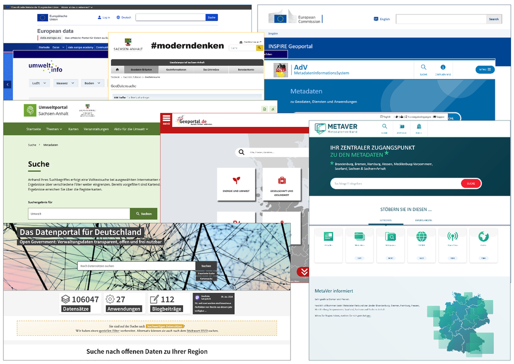

.. meta::
  :description: Qualitativ hochwertige Metadaten erfassen und pflegen
  :keywords: Metadaten, Editor, Geodatensätze, Geodatendienste, Webdienste, Anwendungen, Informationssysteme, Datenbanken, Datensammlungen, Dokumente, Literatur, Projekte, Fachinformationen, Umweltdaten, Geodaten, Erfassung, Pflege, Beschreibung, Dokumentation, IGE-NG, InGrid Editor, Qualität, hochwertig
  :keywords lang=de: InGrid, Editor, Metadatenkatalog, Metadaten, Qualität, hochwertig, Erfassung, Pflege

=========================================================================================
Qualitativ hochwertige Metadaten erfassen und pflegen - Hinweise für Metadatenerfasser -
=========================================================================================

-------------------------------------------------------------------------------------------------------------

| **Portal:** METAVER (MetadatenVerbund)
| **Profil:** Metadatenkatalog Sachsen-Anhalt

| Version: 3.0, 22.10.2024
| Status: in Bearbeitung

--------------------------------------------------------------------------------------------------------------

.. toctree::
   :maxdepth: 4
   :caption: Inhalt

   start/einfuehrung.rst
   recht/grundlagen.rst
   erfassung/hinweise.rst
   optionen/erweiterungen.rst
   kommunikation/kontakt.rst

  .. raw:: html

   <a href="https://metaver-bedienungsanleitung.readthedocs.io/de/latest/index.html" target="_blank">Bedienungsanleitung InGrid-Editor</a>
   

   Abb.: Screenshots Metadatenportale

.. hint:: Hier finden Sie die `Bedienungsanleitung für den InGrid-Editor. <https://metaver-bedienungsanleitung.readthedocs.io/de/latest/index.html>`_

--------------------------------------------------------------------------------------------------------------
